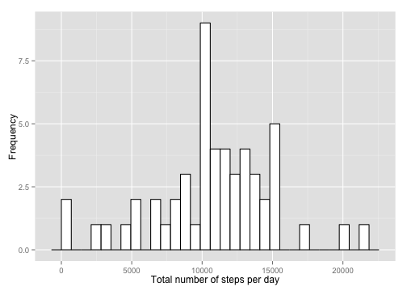
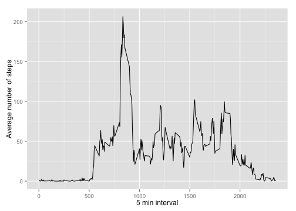
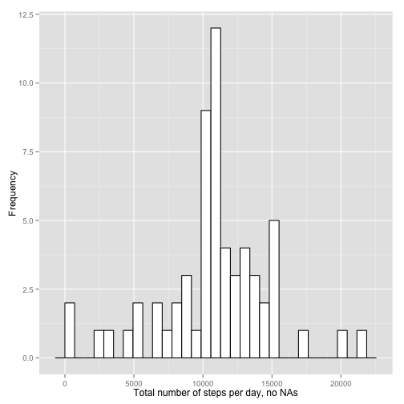
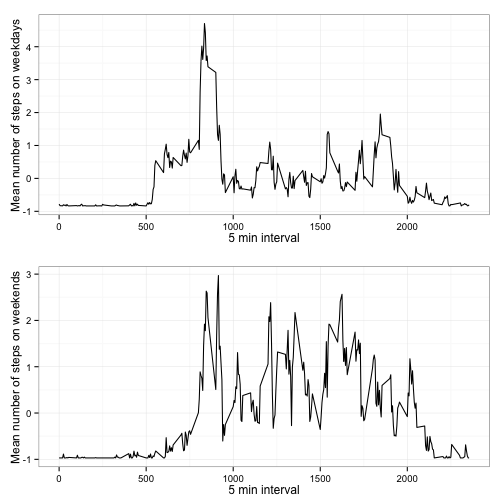

**RR - PEER ASSIGNMENT 1**
========================================================
## A. DATA INFO
Dataset (from [RR webpage][ref]): activity monitoring, containing the variables:  
    * steps: Number of steps taking in a 5-minute interval (missing values are coded as NA)  
    * date: The date on which the measurement was taken in YYYY-MM-DD format  
    * interval: Identifier for the 5-minute interval in which measurement was taken

[ref]:https://class.coursera.org/repdata-003/human_grading/view/courses/972142/assessments/3/submissions


```r
data<-read.csv("~/Desktop/Coursera-RR/Exercises/Assignment1/activity.csv")
str(data)
```

```
## 'data.frame':	17568 obs. of  3 variables:
##  $ steps   : int  NA NA NA NA NA NA NA NA NA NA ...
##  $ date    : Factor w/ 61 levels "2012-10-01","2012-10-02",..: 1 1 1 1 1 1 1 1 1 1 ...
##  $ interval: int  0 5 10 15 20 25 30 35 40 45 ...
```

- R is reading variable *date* as factor; it should read as Date:

```r
data$date<-as.Date(data$date, format="%Y-%m-%d")
str(data)
```

```
## 'data.frame':	17568 obs. of  3 variables:
##  $ steps   : int  NA NA NA NA NA NA NA NA NA NA ...
##  $ date    : Date, format: "2012-10-01" "2012-10-01" ...
##  $ interval: int  0 5 10 15 20 25 30 35 40 45 ...
```

```r
# ok!
```

## B. NUMBER OF STEPS PER DAY

For this task, first of all, I can reorganize the dataset as to show the total number of steps per day:


```r
# Vector - total number of steps:
total<-tapply(data$steps, data$date, function(x)sum(x))
head(total)
```

```
## 2012-10-01 2012-10-02 2012-10-03 2012-10-04 2012-10-05 2012-10-06 
##         NA        126      11352      12116      13294      15420
```

```r
totalsteps<-array(NA, c(length(total),1))
for(i in 1:length(total)){
    totalsteps[i]<-total[[i]]
}
head(totalsteps)
```

```
##       [,1]
## [1,]    NA
## [2,]   126
## [3,] 11352
## [4,] 12116
## [5,] 13294
## [6,] 15420
```

```r
# Vector - days:
date_steps<-c(unique(data$date))
head(date_steps)
```

```
## [1] "2012-10-01" "2012-10-02" "2012-10-03" "2012-10-04" "2012-10-05"
## [6] "2012-10-06"
```

```r
# Double-check type = Date:
str(date_steps)
```

```
##  Date[1:61], format: "2012-10-01" "2012-10-02" "2012-10-03" "2012-10-04" ...
```

```r
# ok!
```


```r
# Create new data frame:
totalsteps_frame<-data.frame(date_steps,totalsteps)
str(totalsteps_frame)
```

```
## 'data.frame':	61 obs. of  2 variables:
##  $ date_steps: Date, format: "2012-10-01" "2012-10-02" ...
##  $ totalsteps: int  NA 126 11352 12116 13294 15420 11015 NA 12811 9900 ...
```
- For the plot, I will use the package 'ggplot2':

```r
require(ggplot2)
```

```
## Loading required package: ggplot2
```

**B.1. Histogram; total # steps per day**

```r
ggplot(aes(x=totalsteps), data=totalsteps_frame)+
    geom_histogram(color="black", fill="white") + ylab("Frequency") + xlab("Total number of steps per day")
```

 

**B.2. Mean and median; total # steps per day**
- Mean:

```r
mean(totalsteps_frame$totalsteps, na.rm=T)
```

```
## [1] 10766
```
The mean is 1.0766 &times; 10<sup>4</sup>.

- Median:

```r
median(totalsteps_frame$totalsteps, na.rm=T)
```

```
## [1] 10765
```
The median is 10765.

## C. AVERAGE DAILY ACTIVITY PATTERN
For this task, I need the average of each first entry (i.e. first 5 min interval) of every day, the average of each second entry (i.e. second 5 min interval), etc.


```r
# Get average per interval:
averages<-tapply(data$steps, data$interval, function(x)mean(x, na.rm=T))
meansteps_interval<-array(NA, c(length(averages),1))
for(i in 1:length(averages)){
    meansteps_interval[i]<-averages[[i]]
}
head(meansteps_interval)
```

```
##         [,1]
## [1,] 1.71698
## [2,] 0.33962
## [3,] 0.13208
## [4,] 0.15094
## [5,] 0.07547
## [6,] 2.09434
```

```r
# Vector - interval:
interval<-unique(data$interval)
str(interval)
```

```
##  int [1:288] 0 5 10 15 20 25 30 35 40 45 ...
```

```r
# Create new dataset:
interval_frame<-data.frame(meansteps_interval, interval)
str(interval_frame)
```

```
## 'data.frame':	288 obs. of  2 variables:
##  $ meansteps_interval: num  1.717 0.3396 0.1321 0.1509 0.0755 ...
##  $ interval          : int  0 5 10 15 20 25 30 35 40 45 ...
```

**C.1. Time series plot; average number of steps of each 5 min interval**

```r
ggplot(aes(x=interval, y=meansteps_interval), data=interval_frame)+
    geom_line() + xlab("5 min interval")+ylab("Average number of steps")
```

 

**C.2. Which 5 min interval has the highest average # of steps?**

```r
(d<-interval_frame$interval[max(interval_frame$meansteps_interval)])
```

```
## [1] 1705
```
The interval 1705 is the one with the highest average number of steps.

## D. IMPUTING NAs

**D.1. Total number of NAs**

```r
missing<-which(is.na(data$steps)==T)
length(missing)
```

```
## [1] 2304
```
The total number of missing values in the dataset is 2304.

**D.2. Fill in NAs with mean values**

```r
# New vector:
steps2<-data$steps
steps2[is.na(steps2)==T]<-mean(data$steps, na.rm=T)
str(steps2)
```

```
##  num [1:17568] 37.4 37.4 37.4 37.4 37.4 ...
```

**D.3. Create data set with ex. 2**

```r
data2<-data
data2$steps<-steps2
str(data2)
```

```
## 'data.frame':	17568 obs. of  3 variables:
##  $ steps   : num  37.4 37.4 37.4 37.4 37.4 ...
##  $ date    : Date, format: "2012-10-01" "2012-10-01" ...
##  $ interval: int  0 5 10 15 20 25 30 35 40 45 ...
```

**D.4. Histogram total number of steps; report mean and median total number of steps/day; do these values differ from first part of the assignment (i.e. with NAs)? What is the impact of NAs?**  
As before, I need a new dataset indicating the total number of steps; this time, however, I will start off with *data2*, the dataset in which NAs were filled in with the means.


```r
# Vector - total number of steps:
total2<-tapply(data2$steps, data2$date, function(x)sum(x))
totalsteps2<-array(NA, c(length(total2),1))
for(i in 1:length(total2)){
    totalsteps2[i]<-total2[[i]]
}
head(totalsteps2)
```

```
##       [,1]
## [1,] 10766
## [2,]   126
## [3,] 11352
## [4,] 12116
## [5,] 13294
## [6,] 15420
```

```r
# Vector - days = date_steps from section B
# Create new dataset
totalsteps_frame2<-data.frame(totalsteps2, date_steps)
str(totalsteps_frame2)
```

```
## 'data.frame':	61 obs. of  2 variables:
##  $ totalsteps2: num  10766 126 11352 12116 13294 ...
##  $ date_steps : Date, format: "2012-10-01" "2012-10-02" ...
```

- Histogram:

```r
ggplot(aes(x=totalsteps2), data=totalsteps_frame2)+
    geom_histogram(color="black", fill="white") + ylab("Frequency") + xlab("Total number of steps per day, no NAs")
```

 

- Mean:

```r
mean(totalsteps_frame2$totalsteps2)
```

```
## [1] 10766
```
The mean is 1.0766 &times; 10<sup>4</sup>, and it is not differente than the mean obtained in section B. This is not surprising; considering how mean is calculated, if mean values are added to the data set, the mean should not change.

- Median:

```r
median(totalsteps_frame2$totalsteps2)
```

```
## [1] 10766
```
The median is 1.0766 &times; 10<sup>4</sup>, which is slightly different than the original median obtained in section B (i.e. 10765). Considering that the original mean (1.0766 &times; 10<sup>4</sup>) and median were similar, the inclusion of mean values in the data set would not be expected to considerably affect the median, as observed. 

## E. WEEKDAYS vs. WEEKENDS
(Use filled-in NAs data set -> data2)

**1. Create variable with 2 factors: weekday and weekend**

```r
# Find days of the week:
data2$whatdayistoday<-weekdays(data2$date)
str(data2)
```

```
## 'data.frame':	17568 obs. of  4 variables:
##  $ steps         : num  37.4 37.4 37.4 37.4 37.4 ...
##  $ date          : Date, format: "2012-10-01" "2012-10-01" ...
##  $ interval      : int  0 5 10 15 20 25 30 35 40 45 ...
##  $ whatdayistoday: chr  "Monday" "Monday" "Monday" "Monday" ...
```

```r
# Create variable:
data2$day<-data2$whatdayistoday
data2$day[data2$day=="Saturday" | data2$day=="Sunday"]<-"weekend"
data2$day[data2$day != "weekend"]<-"weekday"
str(data2)
```

```
## 'data.frame':	17568 obs. of  5 variables:
##  $ steps         : num  37.4 37.4 37.4 37.4 37.4 ...
##  $ date          : Date, format: "2012-10-01" "2012-10-01" ...
##  $ interval      : int  0 5 10 15 20 25 30 35 40 45 ...
##  $ whatdayistoday: chr  "Monday" "Monday" "Monday" "Monday" ...
##  $ day           : chr  "weekday" "weekday" "weekday" "weekday" ...
```

```r
# ok, but change to factors:
data2$day<-as.factor(data2$day)
```

**2. Time series plot of the average number of steps per interval in weekdays & weekends**  
First, I need a data set with the averages:

```r
# Vector - mean weekdays:
wds<-tapply(data2$steps[data2$day=="weekday"], data2$interval[data2$day=="weekday"], function(x)mean(x))
mean_weekdays<-array(NA, c(length(wds),1))
for(i in 1:length(wds)){
    mean_weekdays[i]<-wds[[i]]
}
head(mean_weekdays)
```

```
##       [,1]
## [1,] 7.007
## [2,] 5.384
## [3,] 5.140
## [4,] 5.162
## [5,] 5.073
## [6,] 6.295
```

```r
# Vector - mean weekends:
wks<-tapply(data2$steps[data2$day=="weekend"], data2$interval[data2$day=="weekend"], function(x)mean(x))
mean_weekends<-array(NA, c(length(wks),1))
for(i in 1:length(wks)){
	mean_weekends[i]<-wks[[i]]
}
head(mean_weekends)
```

```
##       [,1]
## [1,] 4.673
## [2,] 4.673
## [3,] 4.673
## [4,] 4.673
## [5,] 4.673
## [6,] 7.923
```

```r
# Vector - interval from before = interval
# Dataset
days_interval<-data.frame(interval, mean_weekdays, mean_weekends)
str(days_interval)
```

```
## 'data.frame':	288 obs. of  3 variables:
##  $ interval     : int  0 5 10 15 20 25 30 35 40 45 ...
##  $ mean_weekdays: num  7.01 5.38 5.14 5.16 5.07 ...
##  $ mean_weekends: num  4.67 4.67 4.67 4.67 4.67 ...
```

- For multiple plots in a single window with ggplot, I need to use function multiplot (available from [cookbook-r][ref]).
[ref]: http://www.cookbook-r.com/Graphs/Multiple_graphs_on_one_page_(ggplot2)


```r
multiplot <- function(..., plotlist=NULL, file, cols=1, layout=NULL) {
  require(grid)

  # Make a list from the ... arguments and plotlist
  plots <- c(list(...), plotlist)

  numPlots = length(plots)

  # If layout is NULL, then use 'cols' to determine layout
  if (is.null(layout)) {
    # Make the panel
    # ncol: Number of columns of plots
    # nrow: Number of rows needed, calculated from # of cols
    layout <- matrix(seq(1, cols * ceiling(numPlots/cols)),
                    ncol = cols, nrow = ceiling(numPlots/cols))
  }

 if (numPlots==1) {
    print(plots[[1]])

  } else {
    # Set up the page
    grid.newpage()
    pushViewport(viewport(layout = grid.layout(nrow(layout), ncol(layout))))

    # Make each plot, in the correct location
    for (i in 1:numPlots) {
      # Get the i,j matrix positions of the regions that contain this subplot
      matchidx <- as.data.frame(which(layout == i, arr.ind = TRUE))

      print(plots[[i]], vp = viewport(layout.pos.row = matchidx$row,
                                      layout.pos.col = matchidx$col))
    }
  }
}
```

- Time series for weekdays (top) and weekends (bottom):

```r
plot1<-ggplot(aes(x=interval, y=scale(mean_weekdays)), data=days_interval)+
    geom_line() + xlab("5 min interval") + ylab("Mean number of steps on weekdays") + theme_bw()
plot2<-ggplot(aes(x=interval, y=scale(mean_weekends)), data=days_interval)+
	geom_line() + xlab("5 min interval") + ylab("Mean number of steps on weekends") + theme_bw()
multiplot(plot1, plot2)
```

```
## Loading required package: grid
```

 
